# Personal Web

**Deskripsi**

Personal web ini merupakan sebuah situs web pribadi yang dirancang sebagai media untuk menampilkan informasi tentang diri seseorang, seperti biodata, galeri foto, dan artikel. Aplikasi ini tidak hanya berfungsi sebagai portofolio digital, tetapi juga sebagai sarana komunikasi antara pemilik web dan pengunjung.

Selain menampilkan konten untuk publik, website ini juga memiliki sistem pengelolaan yang memungkinkan admin atau pemiliknya untuk mengatur dan memelihara seluruh isi situs. Aplikasi dikembangkan menggunakan PHP dan menyimpan data menggunakan database MySQL. Tampilan antarmuka dirancang menggunakan Tailwind CSS agar responsif, modern, dan mudah dikustomisasi.

Website ini memiliki dua bagian utama:
1. **Halaman Publik**, yang dapat diakses oleh semua pengunjung.
2. **Halaman Admin**, yang hanya dapat diakses setelah login, digunakan untuk mengelola konten.

---

**Fitur-fitur**

1. **Login & Logout**  
   Halaman login admin dengan validasi. Logout untuk mengakhiri sesi dengan aman.

2. **Manajemen Artikel**  
   Tambah artikel (judul + isi), edit artikel yang sudah ada, hapus artikel. Artikel ditampilkan di halaman utama, sidebar otomatis update.

3. **Manajemen Gallery**  
   Upload gambar dan judul, ganti atau hapus gambar. Gambar ditampilkan di halaman publik.

4. **Manajemen About**  
   Tambah deskripsi tentang diri, edit bagian “About”, tampilkan deskripsi di halaman utama.

5. **Contact Form**  
   Pengunjung dapat mengirim pesan melalui form kontak. Pesan akan tersimpan di database dan dapat dilihat oleh admin melalui dashboard.

6. **Fitur Komentar**  
   Pengunjung dapat memberikan komentar pada halaman publik. Admin dapat melihat, memoderasi, dan menghapus komentar melalui halaman admin.

7. **Pencarian Artikel & Galeri**  
   Pengunjung dapat mencari artikel atau gambar berdasarkan kata kunci tertentu, sehingga mempermudah eksplorasi konten.

8. **Dark Mode**  
   Pengguna dapat beralih antara mode terang dan mode gelap sesuai preferensi tampilan.

9. **Statistik Pengunjung**  
   Website mencatat jumlah pengunjung dan menampilkannya dalam bentuk angka.
   

**Teknologi yang Digunakan**

1. Bahasa Pemrograman : PHP
2. Database : MySQL
3. Frontend : Tailwind CSS, HTML, Javascript
4. Server Side : Apache / XAMPP

**Struktur Folder**

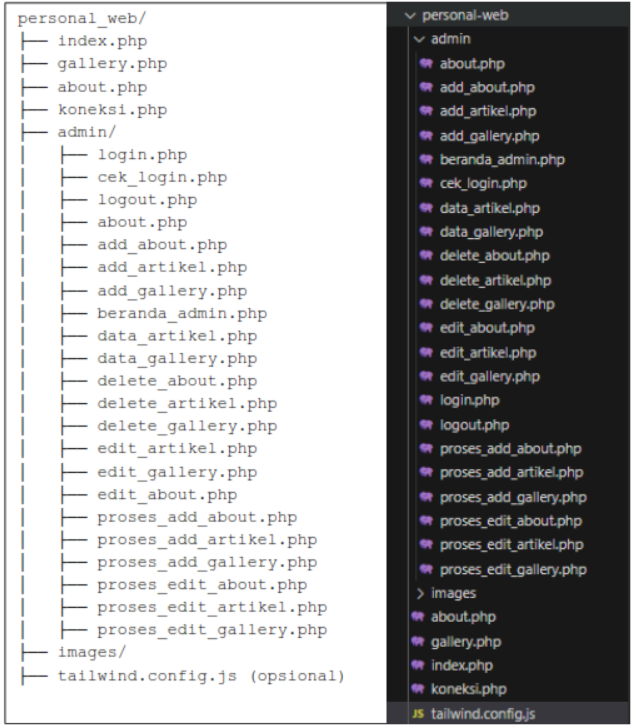

**User Interface Halaman Publik**

A. Halaman Home / Artikel

Halaman Home atau Halaman Artikel adalah halaman yang menampilkan daftar artikel dan artikel terbaru, di halaman tersebut juga terdapat fitur pencarian, fitur kolom komentar serta fitur untuk melihat jumlah pengunjung.

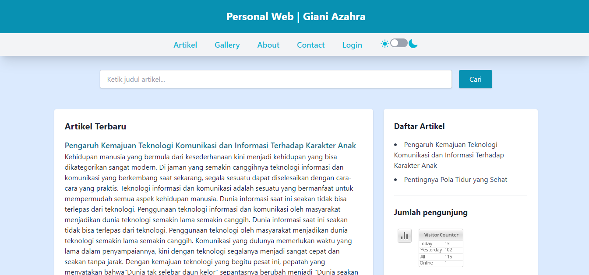

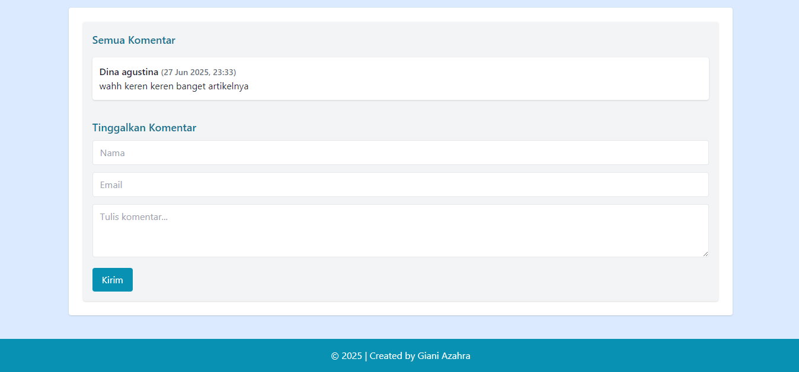

B. Halaman Gallery

Halaman Gallery adalah halaman yang menampilkan foto-foto saya.

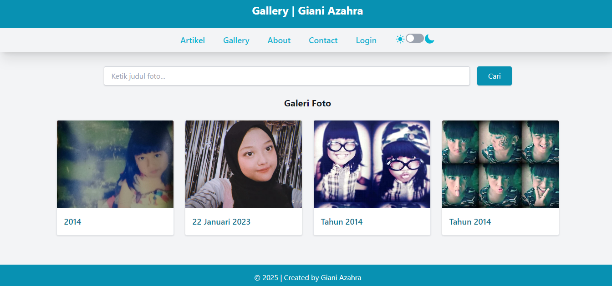

C. Halaman About

Halaman About adalah halaman yang menampilkan deskripsi tentang saya.

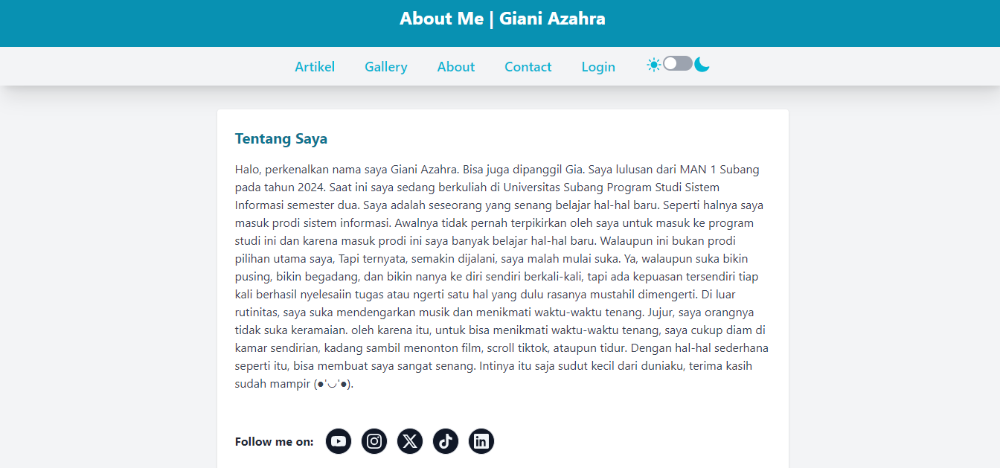

D. Halaman Contact Form

Halaman contact form adalah halaman yang berfungsi bagi pengunjung apabila ingin mengirim pesan kepada admin.

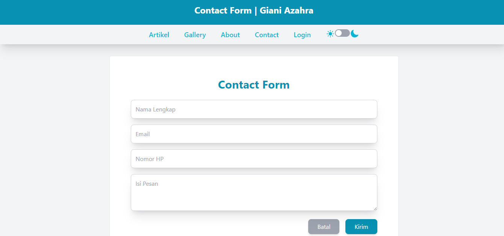

**User Interface Halaman Admin**

A. Halaman Login

Halaman Login adalah halaman yang digunakan untuk mengakses halaman admin, diperlukan username dan password.

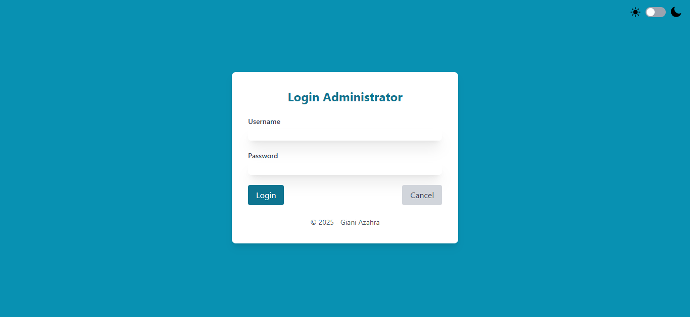

B. Halaman Beranda

Halaman Beranda merupakan halaman yang menampilkan statistik Jumlah Artikel dan Jumlah Gallery.

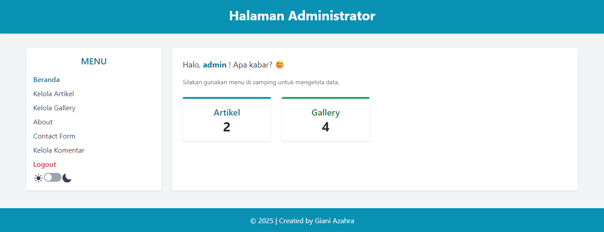

C. Halaman Kelola Artikel

Halaman Kelola Artikel adalah halaman untuk mengelola Artikel dimulai dari Tampil Artikel, Tambah Artikel, Edit Artikel dan Hapus Artikel. Di halaman tersebut juga admin dapat menggunakan fitur pencarian untuk memudahkan dalam pencarian artikel.

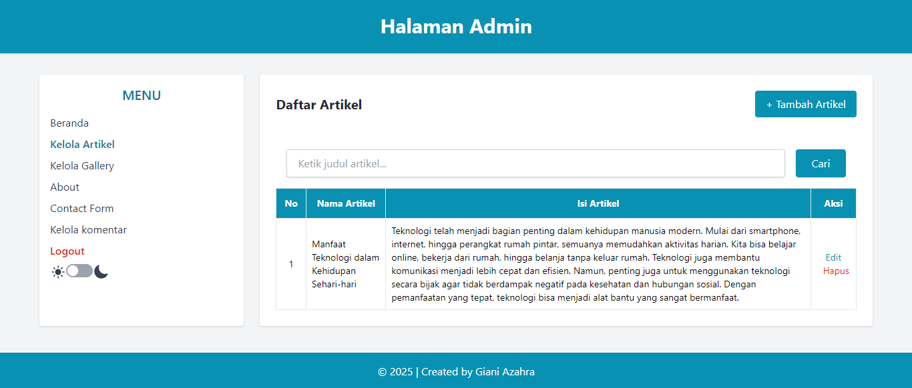

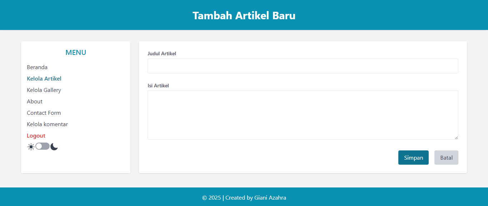

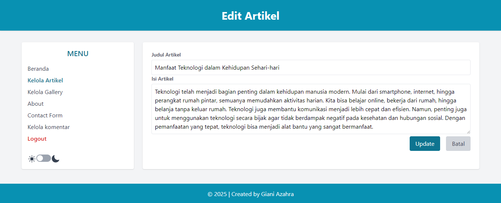

D. Halaman Kelola Gallery

Halaman Kelola Gallery adalah halaman untuk mengelola Gallery dimulai dari Tampil Gallery, Tambah Gallery, Edit Gallery dan Hapus Gallery. Di halaman tersebut juga admin dapat menggunakan fitur pencarian untuk memudahkan dalam pencarian foto.

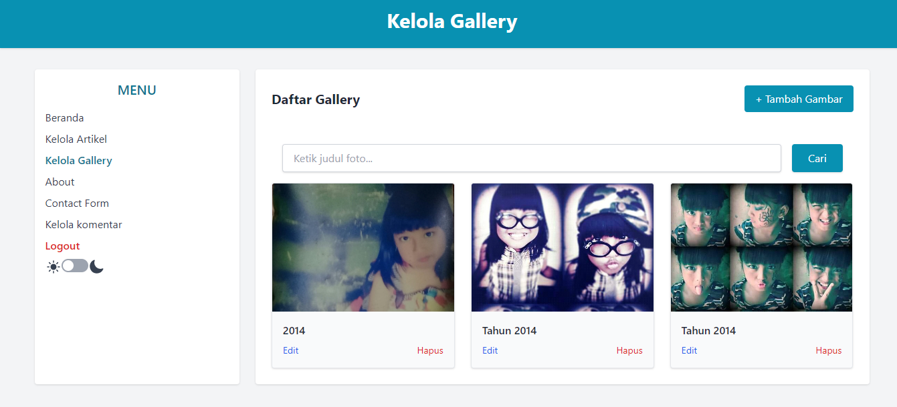

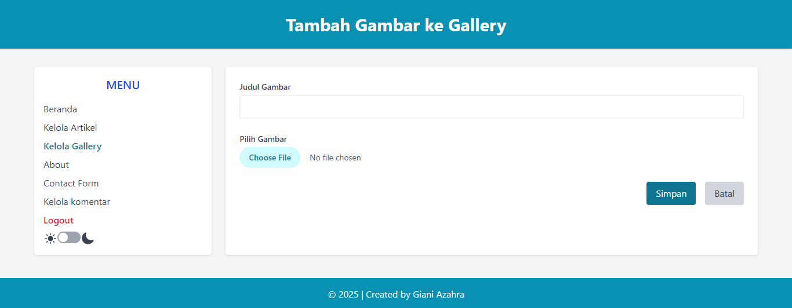

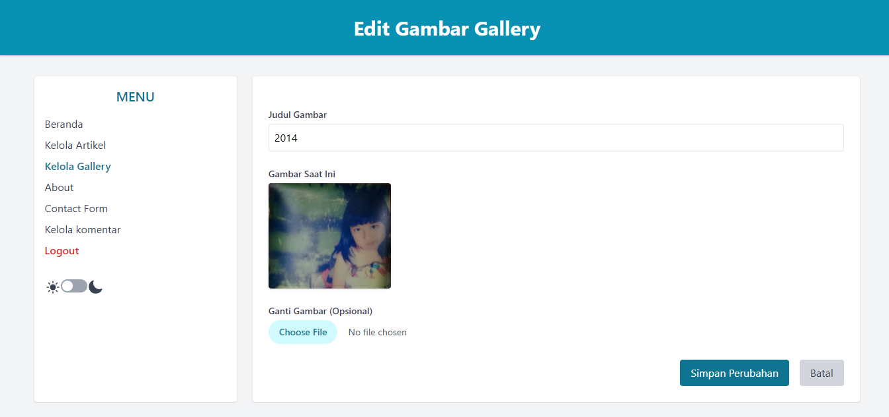

E. Halaman About

Halaman About adalah halaman untuk mengelola About dimulai dari Tampil About, Tambah About, Edit About dan Hapus About.

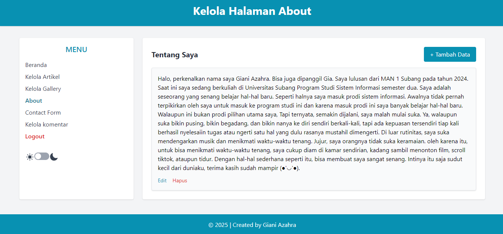

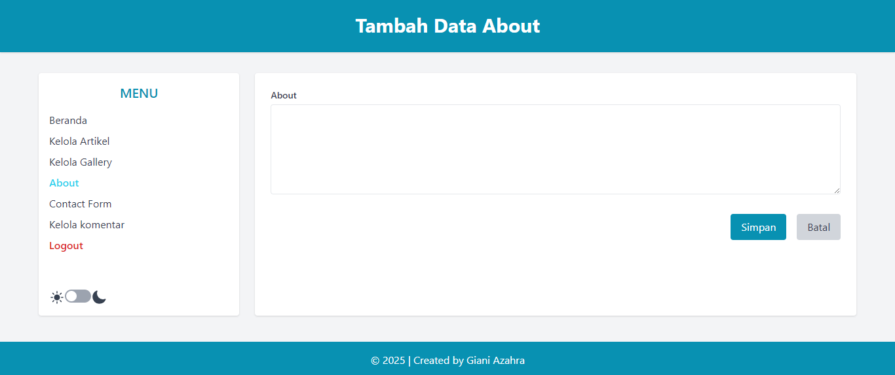

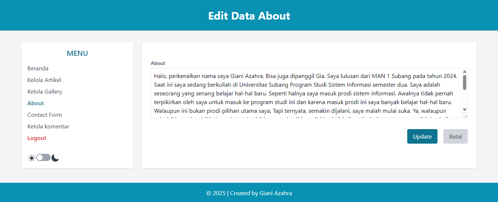

F. Halaman Contact Form

Halaman contact form adalah halaman untuk menampilkan pesan dari para pengunjung yang hanya bisa dibaca oleh admin.

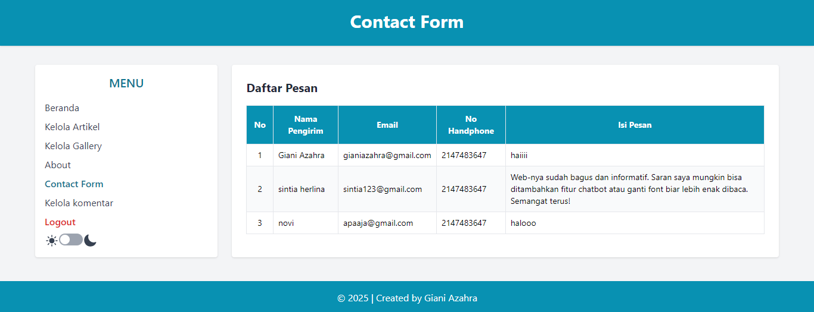

G. Halaman Kelola Komentar

Halaman kelola komentar adalah halaman untuk menampilkan komentar dan admin bisa menghapusnya.

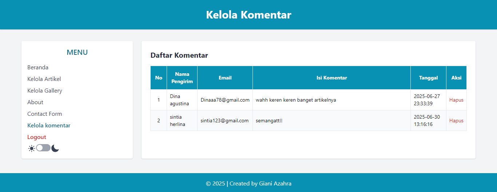

Di setiap halaman di web tersebut terdapat juga fitur darkmode yang memungkinkan pengguna mengubah warna antarmuka (UI) dari terang (light) menjadi gelap (dark).
